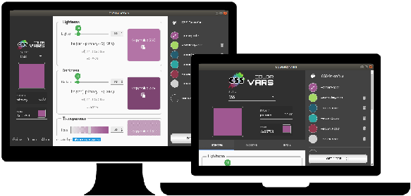

<p align="center">
  
</p>
<p align="center"><b>CSSColorVars (code generation interactive tool), which defines colors with CSS variables, improves the simplicity of the variables and the performance on a website.</b>
<br>
<p align="center">
  
</p>
No longer depend on CSS preprocessors to create color variables, use dynamic CSS variables.
The CSSColorVars interactive tool helps you create your colors with CSS variables and use dynamic functions CSS to apply lightness, darkness and transparency in the color variable.</p>

## Project setup
```
npm install
```

### Compiles and hot-reloads for development
```
npm run serve
```

### Compiles and minifies for production
```
npm run build
```

### Lints and fixes files
```
npm run lint
```
